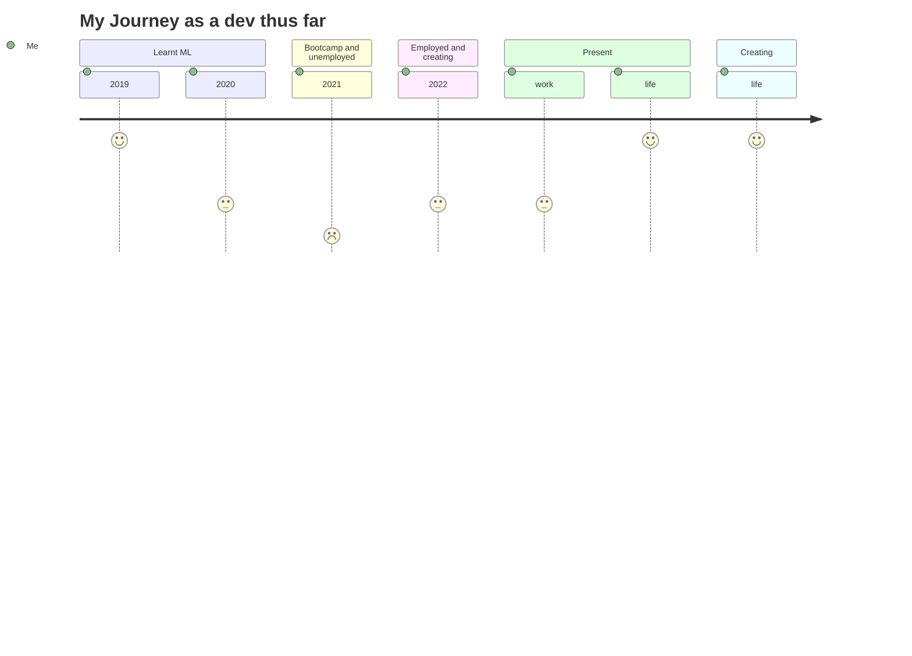

>Creation without purpose is pointless

>Life is constant re-discovery 

- 👋 Hi, I’m @chocomeowy
- 👀 I’m interested in Web development, App development, Machine Learning and other tech that help create a better world. 
- 🌱 I’m currently using Python, Machine Learning, Javascript, ReactJS, NextJS, React Native, MERN stack, Vue, FastApi, Flask, Quasar and SPA, PWA.
- 🍮 Looking into free hosting that is easy to deploy and maintain. render? railway? firebase? supabase? GCP? AWS? 
- 💞️ I’m looking to collaborate on developments or new ideas or new tech.
- 📫 You can reach me here. yongfahjin@hotmail.com
- 🤗 A few of my deployed projects here. https://linktr.ee/yongfahjin

`code ? code : no code` `code && life` not `code || life`
`const life = code && food && time && health` 

