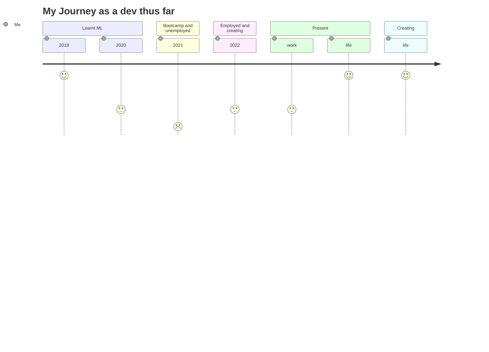

>Creation without purpose is pointless

- 👋 Hi, I’m @chocomeowy
- 👀 I’m interested in Web development, App development, Machine Learning and other latest technologies. 
- 🌱 I’m currently learning Python, Machine Learning, Javascript, React Native, MERN stack, Vue, FastApi, Flask, Quasar and SPA, PWA
- 💞️ I’m looking to collaborate on Web App developments and new ideas
- 📫 You can reach me here. yongfahjin@hotmail.com
- 🤗 A few of my deployed projects here https://linktr.ee/yongfahjin

`code ? code : no code`

