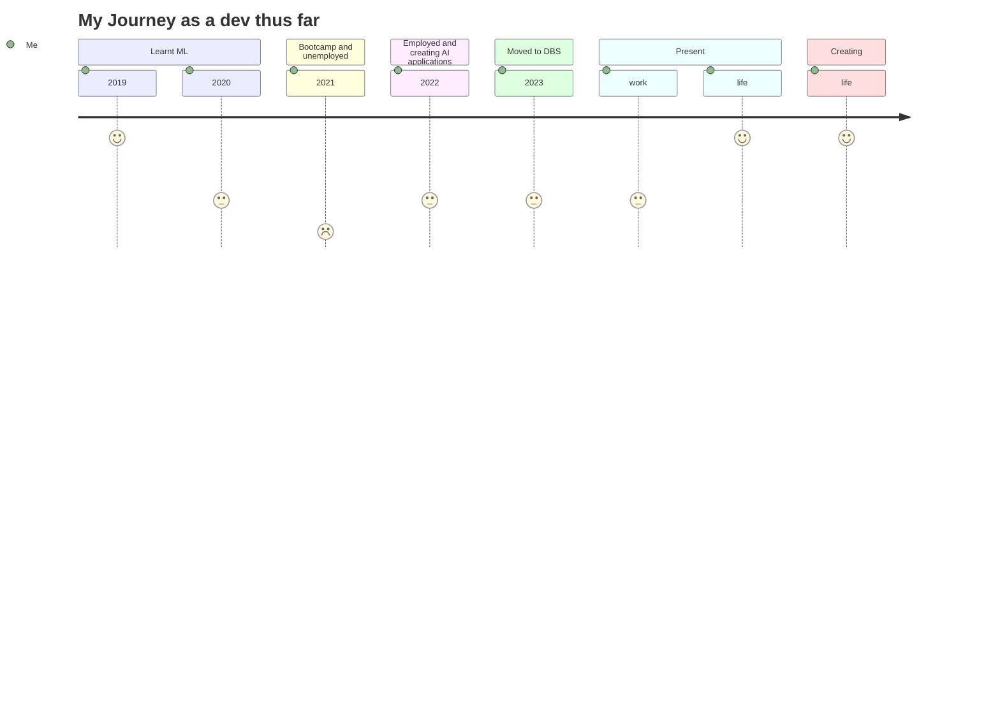

- 👋 Hi, I’m @chocomeowy
- 👀 I’m interested in Web development, App development, Machine Learning and other tech that help create a better world
- 🌱 I’m currently using Python, Machine Learning, Javascript, ReactJS, NextJS, React Native, MERN stack, Vue, AstroJS, FastApi, Flask, django, Quasar and SPA, PWA. ChatGPT. Currently working with ELK elasticsearch, logstash, Kibana, Grafana. 
- 🍮 Current tech tier stack NextJS, MongoDB, vercel. It's all free! Learning TypeScript and Tailwind
- 💞️ I’m looking to collaborate on developments or new ideas or new tech
- 📫 You can reach me here. Feel free to find me! yongfahjin@hotmail.com
- 🤗 A few of my deployed projects here. https://linktr.ee/yongfahjin

>Creation without purpose is pointless

>Life is constant re-discovery 

`const life = code && food && time && health && cat` 

